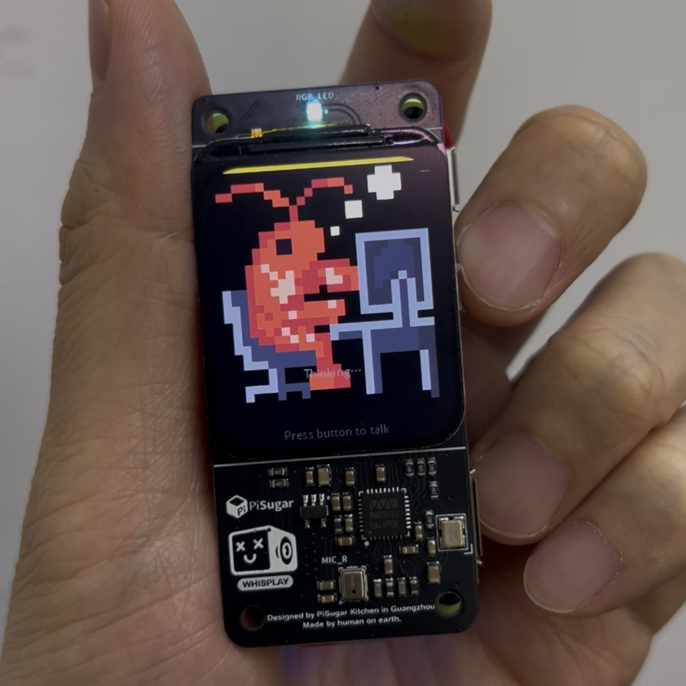

# PokeClaw

[English](README_EN.md) | [中文](README.md)

[](https://youtube.com/shorts/Jh96Oza_5nA)
*🎬 Click the image to watch the YouTube Shorts demo*

PokeClaw is a voice-controlled AI desktop assistant built on a Raspberry Pi Zero W utilizing the [PiSugar WhisPlay board](https://www.pisugar.com). Simply press the physical button to speak, and get a streamed response on the 1.54" LCD accompanied by an animated character (defaults to "kirby" or "lobster") and TTS playback.

**PokeClaw** is detached and originally forked from [pizero-openclaw](https://github.com/sebastianvkl/pizero-openclaw). A huge thanks to the original author [sebastianvkl](https://github.com/sebastianvkl) for their MIT licensed contributions, which provided the solid hardware driver and communication foundation for this project!

## How it works

```
Button press → Record audio → Transcribe (OpenAI/Gemini/GLM) → Stream LLM response (OpenClaw) → Real-time Display on LCD
                                                                                                  ↓
                                                                                        (Optional) Speak aloud (TTS)
```

1. **Press & hold** the button to record your voice via ALSA
2. **Release** — the WAV is sent to OpenAI, Gemini, or Zhipu GLM for ultra-fast transcription (~0.7s)
3. The transcript is streamed to your **[OpenClaw](https://openclaw.ai) gateway** for a response
4. Text streams onto the **LCD** in real time with pixel-accurate word wrapping, like a typewriter
5. Optionally **speaks the response** via TTS as soon as the first sentence completes. Includes a **Smart Preprocessing System**: automatically converts numbers to spoken Chinese, masks unreadable Markdown tables with placeholders, converts bullet points to ordered ordinals ("First...", "Second..."), and strips formatting such as bold or italics. Meanwhile, the **original raw text** (with formatting and digits) is still displayed on the screen for a clear visual-vocal separation.
6. The idle screen shows a clock, date, battery %, and WiFi status
7. When active, the character animation loops fluidly between listening, thinking, and talking states. When talking, it automatically **lip-syncs** to the volume (RMS) of the TTS output!

The device includes a **silence gate** to skip empty recordings, and OpenClaw automatically maintains your **conversation memory** across exchanges via cloud session keys.

## Hardware

- **Raspberry Pi Zero 2 W** (or Pi Zero W)
- **[PiSugar WhisPlay board](https://www.pisugar.com)** — 1.54" LCD (240x240), push-to-talk button, LED, speaker, microphone
- **PiSugar battery** (optional) — reads and shows charge level on screen

## Setup

### Prerequisites

- Raspberry Pi OS (Bookworm or later)
- Python 3.11+
- API keys for speech-to-text and TTS (OpenAI, Google Gemini, Zhipu GLM, or **ByteDance Doubao**)
- An [OpenClaw](https://openclaw.ai) gateway running somewhere accessible on your network

### Install dependencies

> [!IMPORTANT]
> Since this project supports rendering Chinese characters on the screen, you **must** install the Chinese font library (`fonts-wqy-microhei`) to prevent text corruption.

```bash
sudo apt install python3-numpy python3-pil fonts-wqy-microhei
pip install requests python-dotenv
```

Ensure the WhisPlay hardware driver is installed and loaded properly per the [PiSugar WhisPlay setup guide](https://github.com/PiSugar/whisplay-ai-chatbot).

### Configure

Copy the example env file and fill in your keys:

```bash
cp .env.example .env
```

Edit `.env`:

```bash
export OPENAI_API_KEY="sk-your-openai-api-key"
export AUDIO_PROVIDER="doubao" # "openai", "gemini", "glm", or "doubao"
export DISPLAY_CHARACTER="lobster" # defaults to "kirby". Options: "kirby" or "lobster"
export PI_USER="pi" # Change this if your Raspberry Pi username is different
export GLM_API_KEY="your-glm-api-key"
export DOUBAO_APPID="your-appid"
export DOUBAO_ACCESS_TOKEN="your-token"
export OPENCLAW_TOKEN="your-openclaw-gateway-token"
```

### Run

```bash
python3 -m core.main
```

Or deploy as a systemd background service using the included `sync.sh` script.

## Configuration Cheat Sheet

Advanced settings can be configured via environment variables (in `.env`) and defaults hardcoded in `core/config.py`:

| Variable | Default | Description |
|---|---|---|
| `AUDIO_PROVIDER` | `openai` | API provider for STT & TTS (`openai`, `gemini`, `glm`, or `doubao`) |
| `DOUBAO_APPID` | _(required if doubao)_ | Doubao/Volcengine AppID |
| `DOUBAO_ACCESS_TOKEN` | _(required if doubao)_ | Doubao Bearer Token |
| `DOUBAO_VOICE_TYPE` | `bv001_streaming` | Doubao voice selection code |
| `DISPLAY_CHARACTER` | `kirby` | The character sprite animation pack (`kirby` or `lobster`) |
| `OPENAI_API_KEY` | _(required if openai)_ | OpenAI API key |
| `GEMINI_API_KEY` | _(required if gemini)_ | Gemini API key |
| `GLM_API_KEY`    | _(required if glm)_    | Zhipu GLM API key |
| `OPENCLAW_TOKEN` | _(required)_ | Auth token for the OpenClaw gateway |
| `OPENCLAW_BASE_URL` | `https://...` | OpenClaw gateway URL |
| `ENABLE_TTS` | `false` | Speak responses aloud |
| `LCD_BACKLIGHT` | `70` | Backlight brightness (0–100) |
| `SILENCE_RMS_THRESHOLD` | `200` | Audio RMS below this is skipped |

## Smart TTS Preprocessing

To make the assistant's voice sound more natural, the project includes a built-in preprocessing engine optimized for Chinese:

- **Digit-to-Chinese**: Automatically converts `129.80` to Chinese reading, and handles years (e.g., `2025` read as single digits).
- **Markdown Stripping**: Automatically removes bold (`**`), italic (`*`), inline code (`` ` ``), headers (`#`), and links.
- **Structural Content Recognition**:
  - **Table Masking**: Detects Markdown tables and replaces them with a prompt ("I've summarized a table here for you to read on screen") to avoid reading gibberish.
  - **List Optimization**: Converts unordered lists (`- `) into ordered readings ("First...", "Second...").
- **Visual-Vocal Separation**: The LCD displays the **original formatted Markdown** text, while the TTS plays only the **cleaned, natural speech**.

*(See `.env.example` for all advanced configuration options)*

## TO-DO List

- [ ] Support more underlying LLM/TTS/STT API models
- [ ] Develop more character animations and support richer emotional expressions (happy, angry, sad, etc.)

## License

MIT License

This project was originally forked from [pizero-openclaw](https://github.com/sebastianvkl/pizero-openclaw). Thank you to the open-source community!
